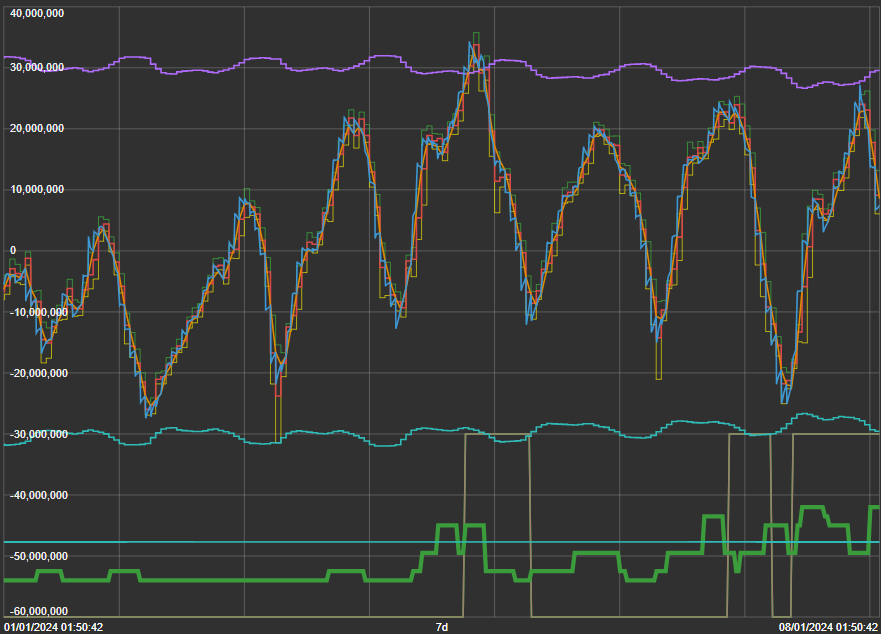
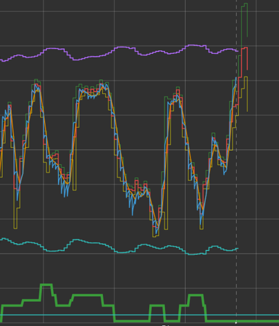

# MTSPC-GPT
## Finetuning Pretrained GPT-2 for Dutch TTF Gas Imbalance Prediction: A Mixed Time Series Prediction and Classification Approach
[FULL THESIS](thesis_King.pdf)

# Top 50 Features with Short Explanations, SBS means the Gas Balancing Signal
| Feature               | Explanation                                                  |
|-----------------------|--------------------------------------------------------------|
| dt_wk_sin_sbs         | Sine transformation of weekdays for SBS data                 |
| MACDEXTHIST_sbs       | MACD histogram for SBS data                                  |
| Mean_apx_nl           | Power Price of the Netherlands                               |
| HT_DCPERIOD_sbs       | Hilbert Transform Dominant Cycle Period for SBS data         |
| helpers_sbs           | Suppliers Signal                                             |
| green_max_sbs         | Absolute value of imbalance (light green zone) threshold     |
| MACDEXT_sbs           | MACD line value for SBS data                                 |
| MACDEXTSIGNAL_sbs     | MACD signal line value for SBS data                          |
| generation_2_nl       | Wind power generation forecast (48h) in the Netherlands      |
| causers_sbs           | Customers Signal                                             |
| dt_day_sin_sbs        | Sine transformation of days for SBS data                     |
| cloud_2_ber           | Cloud cover forecast (48h) in Berlin                         |
| wind_dir_2_ams        | Wind direction forecast (48h) in Amsterdam                   |
| cloud_2_ams           | Cloud cover forecast (48h) in Amsterdam                      |
| generation_1_nl       | Wind power generation forecast (24h) in the Netherlands      |
| generation_2_de       | Wind power generation forecast (48h) in Germany              |
| precip_1_ams          | Precipitation forecast (24h) in Amsterdam                    |
| dew_point_2_ber       | Dew point forecast (48h) in Berlin                           |
| dew_point_0_ams       | Dew point forecast (12h) in Amsterdam                        |
| temperature_1_ber     | Temperature forecast (24h) in Berlin                         |
| cloud_1_ber           | Cloud cover forecast (24h) in Berlin                         |
| PPO_sbs               | Percentage Price Oscillator for SBS data                     |
| precip_2_ber          | Precipitation forecast (48h) in Berlin                       |
| dew_point_1_ams       | Dew point forecast (24h) in Amsterdam                        |
| wind_1_ams            | Wind speed forecast (24h) in Amsterdam                       |
| wind_dir_1_ber        | Wind direction forecast (24h) in Berlin                      |
| wind_dir_1_uk         | Wind direction forecast (24h) in the UK                      |
| dew_point_1_uk        | Dew point forecast (24h) in the UK                           |
| wind_dir_2_ber        | Wind direction forecast (48h) in Berlin                      |
| dew_point_2_uk        | Dew point forecast (48h) in the UK                           |
| wind_dir_2_uk         | Wind direction forecast (48h) in the UK                      |
| wind_2_uk             | Wind speed forecast (48h) in the UK                          |
| dew_point_0_uk        | Dew point forecast (12h) in the UK                           |
| cloud_2_uk            | Cloud cover forecast (48h) in the UK                         |
| cloud_1_uk            | Cloud cover forecast (24h) in the UK                         |
| dew_point_0_ber       | Dew point forecast (12h) in Berlin                           |
| generation_0_nl       | Wind power generation forecast (12h) in the Netherlands      |
| wind_dir_1_ams        | Wind direction forecast (24h) in Amsterdam                   |
| dew_point_1_ber       | Dew point forecast (24h) in Berlin                           |
| wind_0_ber            | Wind speed forecast (12h) in Berlin                          |
| wind_1_uk             | Wind speed forecast (24h) in the UK                          |
| wind_2_ber            | Wind speed forecast (48h) in Berlin                          |
| high_sbs              | Last High price for SBS data                                 |
| wind_dir_0_ber        | Wind direction forecast (12h) in Berlin                      |
| dew_point_2_ams       | Dew point forecast (48h) in Amsterdam                        |
| precip_2_ams          | Precipitation forecast (48h) in Amsterdam                    |
| precip_0_ams          | Precipitation forecast (12h) in Amsterdam                    |
| precip_0_ber          | Precipitation forecast (12h) in Berlin                       |
| cloud_0_ber           | Cloud cover forecast (12h) in Berlin                         |
| close_sbs             | Last Closing price for SBS data                              |

## Abstract
While Large Language Models (LLM) have achieved significant success in
natural language processing (NLP) and computer vision (CV), their applic-
ation in time series analysis has been limited due to the lack of large-scale
training data. This thesis addresses this challenge by finetuning pre-trained
models from language or computer vision, trained on billions of tokens, for
time series analysis. This thesis evaluates the Frozen Pretrained Transformer
(FPT), which leverages the self-attention and feedforward layers of residual
blocks from pre-trained models. The paper introduces MTSPC-GPT, a novel
approach that focus on fine-tuning the pre-trained GPT2 model for multi-
task learning, specifically for mixed time series prediction and classification.
This approach enables the model to concurrently perform classification and
forecasting tasks. The study also explores various methods to enhance the
predictability of gas-related time series, such as the Dutch TTF Gas Balan-
cing Signal, by integrating external features like weather data, power fore-
cast data, temporal features, and technical indicators. The results indicate
that these pre-trained models can deliver comparable or even superior per-
formance on public time series classification datasets and the Dutch TTF
Gas Imbalance Dataset.

# Visualization of Gas Balancing Predictive Indicators

This visualization represents various predictive indicators for gas balancing. Each color in the image has a specific meaning related to gas balancing signals and predictions:

- **Blue**: Represents the Gas Balancing Signal.
- **Purple and Light Blue**: Denote the thresholds for Imbalance.
- **Green**: Indicates the Probability of Imbalance for the next 5-12 hours.
- **Dark Yellow**: Signifies the Prediction of Imbalance within the Hour.

- 

This visualization represents next 1-5 hours forecast for gas balancing:

- **Dark Green**: Upper interval(95%).
- **Red**: 50% prediction.
- **Yellow**: Lower interval(5%).
